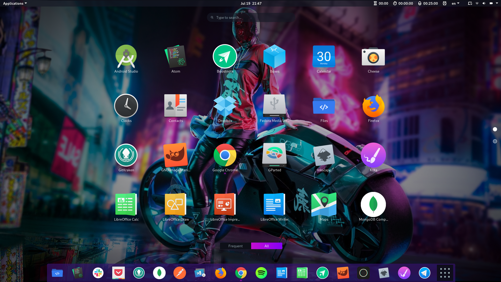

Seguramente has escuchado hablar de Linux, esa alternativa Open Source que se enfrenta a Windows y Apple en el mundo de los sistemas operativos. Sin embargo lo que muchos no saben es que Linux está en todas partes, desde tu teléfono móvil, router y básicamente la mayor parte del Internet está construido con él. Tan solo en el 2015 más del 67% de servidores públicos en Internet usaban Linux, impresionante ¿no?

Linux es una agrupación de diferentes sistemas operativos open source, que son desarrollados por una comunidad enorme de entusiastas programadores, e incluso algunos cuentan con el respaldo de empresas importantes, como es el caso de Fedora que es apoyado por Red Hat.

## ¿Por qué deberías aprender a usarlo?

Como te mencione antes Linux está básicamente en todo, así que mientras más rápido aprendas sobre él, mucho mejor para ti.

El familiarizarte a esta clase de sistemas al inicio puede llegar a ser algo complicado, pues no estamos acostumbrados a revisar diferentes aspectos de nuestro sistema, como lo puede ser configurar los drivers manualmente, usar la terminal o hacer particiones de disco para instalar correctamente el sistema. Normalmente la dinámica que se sigue en Windows o Apple es dar click en “siguiente” a todo, hasta que se instale automáticamente (lo que no siempre pasa).

Sé que en este momento puedes estar pensando ¿para qué necesito aprenderlo si es mucho más complicado? Pero la realidad es que las bondades que nos ofrece Linux son infinitas. Desde la compatibilidad que tiene con diferentes lenguajes de programación, la profunda configuración que llega a tener para adaptarse a tus necesidades, o el simple hecho de que es gratis y abierto a todo el mundo, son cualidades que lo hacen muy atractivo.

Pero si aún no estás convencido, aquí te dejo una lista con las cosas que más me gustan de Linux.

### Alta personalización

Es impresionante el nivel de modificaciones que le puedes hacer. En Windows usualmente estamos acostumbrados a las características que viene por defecto de fábrica. No tenemos la opción de poder cambiar el cómo se ve el escritorio, el estilo de los iconos, incluso los colores de selección o los sonidos de inicio.

Al contrario Linux te permite modificar cada aspecto. ¿No te gusta cómo se ve? Entonces lo puedes modificar tú mismo hasta que quede a tu gusto. Y esto no solamente es referente a lo estético, también puedes cambiar aspectos importantes del sistema como lo pueden ser qué programas se ejecutan cada cierto tiempo o la gestión de usuarios. Es como ir al mercado, comprar todas las cosas que te gustan y siempre llevarlas contigo.

Por ejemplo, así luce el escritorio de mi computadora. El sistema operativo que uso es Fedora 30.

### Comodidad al momento de desarrollar

En la mayoría de sistemas Linux, los compiladores y herramientas para empezar a programar ya vienen configuradas. Y si no lo están es muy sencillo de instalarlas, con un par de líneas de comandos en la terminal tendrás perfectamente configurado Node JS, Python, etc. Olvida esos errores de compatibilidad que sucedían en Windows.

Además la integración con sistemas de control como lo es Git, es muy fácil de configurar, nunca me había sentido tan cómodo programando en un sistema operativo cómo lo hago en Linux.

### Rapidez y rendimiento inigualables

Si tienes un equipo viejo el cual ya no sea veloz con las nuevas versiones de Windows, no dudes ni un solo instante en darle una nueva vida con Linux. 

Recuerdo que cuando iba en la preparatoria no tenía la mejor computadora del mundo, era una laptop emachines (ya ni siquiera existe esa marca). Sólo contaba con 2 gb de ram y un procesador intel celeron, sin embargo decidí usar Ubuntu en ese equipo y hasta el día de hoy sigue funcionando de maravilla. ¿Te imaginas lo rápido que sería tu equipo si usaras Linux?

### Gran variedad para elegir

Todos los sistemas de Linux usan algo llamado kernel, que lo podemos ver como si fuera el corazón del sistema operativo. Todos ellos usan el mismo kernel para poder funcionar, pero cada uno decide qué paquetes de software extra le añade a la distribución. Hay distribuciones enfocadas con propósitos de uso general, como lo es Ubuntu o Fedora, otras enfocadas a la privacidad como lo puede ser Tails, incluso existen distribuciones enfocadas a seguridad informática como lo es Kali Linux.
  
Si lo quieres ver de manera más sencilla, imagina que el kernel de Linux es como la carne de una hamburguesa, y las distribuciones son la la hamburguesa ya preparada, contando con todos los ingredientes que a ti más te gusten. 

Así que te invito a que seas valiente y pruebes alguna de las muchas distribuciones que existen. Si ya estás completamente decidido de querer usar Linux, te recomiendo algunas de las distribuciones ideales para iniciar.

- [Ubuntu](https://ubuntu.com/)
- [Fedora](https://getfedora.org/)
- [Linux Mint](https://linuxmint.com/)
- [Zorin OS](https://zorinos.com/)
- [Elementary OS](https://elementary.io/)
