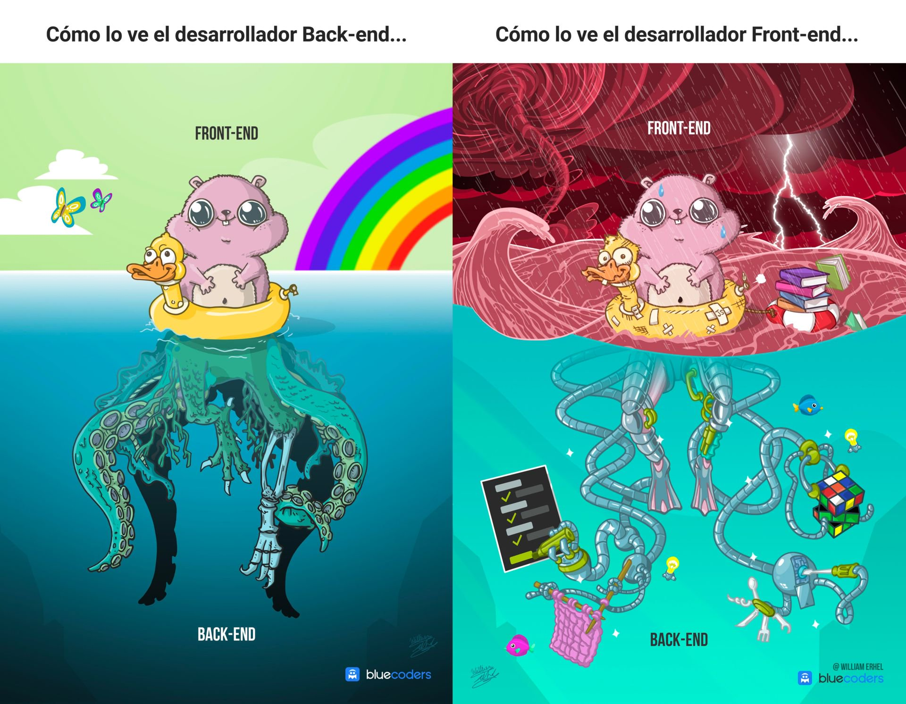

Cuando hacemos aplicaciones web estamos acostumbrados a pensar unicamente en el frontend, es decir, el HTML, CSS y JS. Sin embargo el encargado de desarrollar toda la lógica de negocios, mandar e insertar información a nuestra base de datos, o hacer la autenticación de usuarios es el backend.

Dependiendo de que te guste hacer es muy posible que te sientas identificado con alguno de estos dos adorables hamsters 🐹.

Si te llegas a sentir abrumado con el backend es que estás en el lugar correcto, con esta pequeña serie de tutoriales de express podrás crear completamente un backend, en este caso la aplicación que desarrollaremos será un foro llamado *HyperCode*.

## Conceptos clave

Antes de empezar a desarrollar este genial proyecto, primero deberías repasar unos cuantos conceptos para que te quede claro. Si considerás que ya eres todo un crack en esto del código te einvito a que te saltes esta sección.

### ¿Qué es express JS?

Según la [página oficial de express](https://expressjs.com/es/):

> Express es una infraestructura de aplicaciones web Node.js mínima y flexible que proporciona un conjunto sólido de características para las aplicaciones web y móviles.

Algo muy interesante de express  es que se define como *minimalista*, esto quiere decir que la construcción de nuestra api lo hará con la menor cantidad de elementos o pasos posibles, esto se traduce a mucho menos código y una sintaxis mucho más clara.

Con express nosotros podremos crear una infraestructura *backend* para poder enviar y recibir datos, en especifico en este proyecto nos conectaremos a una base de datos en MongoDB Atlas para la creación de un foro.

Además lo más poderoso que tiene express es la utilización de *middlewares*, que son un fragmento de código que nos permite manipular los *[requests](https://expressjs.com/es/4x/api.html#req)* y *[responses](https://expressjs.com/es/4x/api.html#res)* de nuestra aplicación.

### Peticiones y Respuestas

Cuando nosotros solicitamos algún recurso a nuestro servidor, a eso le llamaremos una **petición** (*request*), y normalmente este nos regresa una **respuesta** (*response*), diciéndonos si la petición se pudo hacer o no, esto lo hace a través de un código, a este código se le conoce como estatus http. 

Por ejemplo cuando vas a la página Google y das click en buscar, en ese momento estás realizando una petición al servidor de Google, y este te regresa una respuesta con la información que estabas buscando, el estatus http que regresa es un estatus 200, que significa que todo va ok 👌. Si al contrarío la conexión no se logra porque hay mucha gente usando el servicio, el estatus que se regresa es un estatus 500 diciéndonos que no es posible realizar la petición 🙁.

Si quieres saber más de los estatus HTTP y para que sirve cada uno, te dejo esta [página](https://http.cat/) donde unos gatos lo explican mejor que yo. 

### ¿Qué es REST?

*Representational state transfer* ***(REST)*** es un estilo de arquitectura para crear servicios web, no es un estándar pero es considerada una especificación, fue creada por Roy Fielding quien es cofundador de Apache Software Foundation. Si quieres aprender más sobre esta arquitectura te dejo más ingo en este [link](https://bbvaopen4u.com/es/actualidad/api-rest-que-es-y-cuales-son-sus-ventajas-en-el-desarrollo-de-proyectos).

### Verbos HTTP

REST hace uso de los verbos http, que son los encargados de manejar las peticiones al servidor, estos son los que le dicen al servidor que debe hacer. Piénsalo como si fuera darle una orden a un perrito, este puede rodar, saltar, o hacerse el muerto. Los verbos http hacen algo similar, ellos son los que le dicen al servidor que acciones CRUD se deben ejecutar y con que entidad lo deben de hacer, si quieres mas info checa esta [documentación de verbos http](https://developer.mozilla.org/es/docs/Web/HTTP/Methods). 

Por ejemplo si nosotros en nuestro navegador pusiéramos un link como:
> https://apiasombrosa/api/usuarios

Nosotros podríamos acceder a todos los verbos http de esa ruta que esta relacionada en este caso con lo usuarios:

| VERBO HTTP    |                   /api/usuarios                   |                               /api/usuarios:id |
| ------ | :-----------------------------------------------: | ---------------------------------------------: |
| GET    | lista a todos los usuarios dentro de la colección | lista solo al usuario que coincida con el 'id' |
| PUT    |           Remplaza en toda la colección           |  Remplaza o crea solo UN usuario en especifico |
| PATCH  |                   No hace nada                    |           Actualiza a un usuario en especifico |
| POST   |       Crea un nuevo usuario en la colección       |                                   No hace nada |
| DELETE |             Elimina toda la colección             | Elimina a un usuario en especifico con el 'id' |

### API

Application programming interface **(API)** es una interfaz que nos permite conectar nuestro frontend con nuestro backend. En una llamada telefónica entre dos casas lo que podríamos relacionar con el concepto de API sería el cable que conecta a los dos teléfonos.

#### ¡Felicidades! 🎉

Ahora que ya dominas parte de los fundamentos para poder empezar a desarrollar este proyecto de backend, continua con el siguiente tutorial.