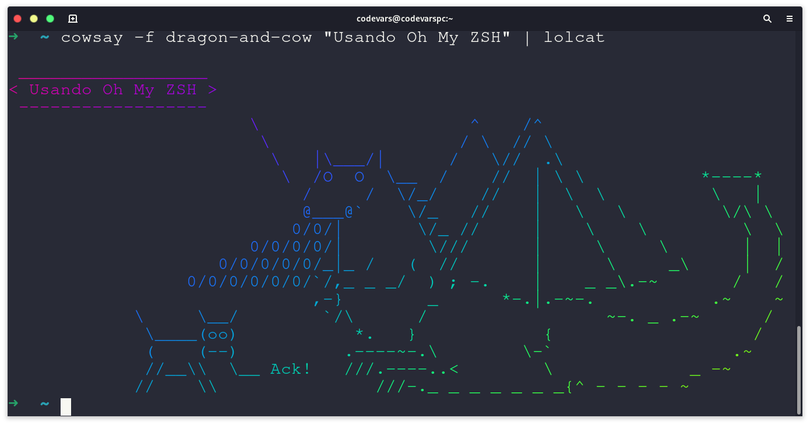
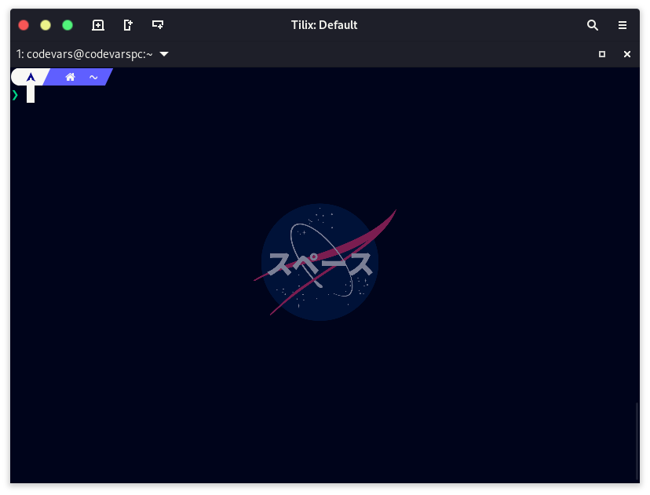

La terminal es sin duda una de las herramientas que más utiliza cualquier desarrollador o desarrolladora. Así que si quieres darle un toque personal a esa ventanita que te ayuda a correr todos tus comandos no te despegues de este post. Con unas cuantas configuraciones veremos cómo cambiar los colores, poner íconos,  temas y hasta una imagen de fondo si lo deseas.

## Primero instala Zsh en tu terminal

Las terminales funcionan con una pequeña pieza de software que nos permite ingresar comandos e interactuar con el sistema de nuestra computadora. Este software se le conoce genéricamente como **interprete de comandos** o ***shell***. Por defecto, la gran mayoría de sistemas Unix/Linux vienen con una *shell* llamada Bash, pero recientemente hay un cambio por usar Zsh que es más amigable y viene con muchas mejoras. Incluso macOS ya la usa por defecto en su versión Catalina.  Para instalarla solo debes abrir tu terminal y ejecutar el manejador de paquetes dependiendo tu sistema: 

**Ubuntu / Debian**

```bash
sudo apt install zsh
```

**Fedora**

```bash
sudo dnf install zsh
```

**Arch Linux**

```bash
sudo pacman -Sy zsh
```

Para comprobar que se instalo correctamente solo revisa la versión de tu nueva *shell* con:

```bash
zsh --version
```

Lo último que necesitas hacer es configurarla como tu interprete por defecto. Esto lo puedes hacer con la utilidad `chsh`, que significa *"change shell"*. Esto lo puedes ver en el siguiente comando que busca el binario de Zsh y lo configura por defecto:

```bash
chsh -s $(which zsh) 
```

💡**Nota:** si el comando `chsh` no viene instalado por defecto prueba buscando e instalando el paquete `util-linux` para tu sistema. 

## Dale superpoderes a tu terminal con Oh My Zsh

Oh My Zsh es lo mejor de Zsh, básicamente es como si a tu terminal le pusieras esteroides ya que te permite instalar temas, *plugins* y muchas funcionalidades que te harán la vida más fácil.  Para instalarlo solo necesitas ejecutar este comando en tu terminal y el script de instalación hará el resto: 

```bash
sh -c "$(curl -fsSL https://raw.github.com/ohmyzsh/ohmyzsh/master/tools/install.sh)"
```

Al terminar podrás ver como el cursor de tu terminal luce completamente diferente. Esto es porque el tema de Oh My Zsh ya se ve reflejado en tu sistema. Acá un ejemplo de cómo se ve con un mensaje usando `cowsay` y un dragón. 



## Personaliza tu nueva terminal

Aunque estés acostumbrado a usar la vieja pero confiable terminal por defecto del sistema,  es mucho mejor si cambias a un emulador de terminal como Tilix, que personalmente es mi favorita. Esta terminal te permite hacer *window spliting* además de una personalización profunda, desde cambio de esquemas de colores, fuentes, opacidades y fondos. Todo de una manera amigable y sencilla. Para instalarla basta con ejecutar el siguiente comando dependiendo tu sistema: 

**Ubuntu / Debian**

```bash
sudo apt install tilix
```

**Fedora**

```bash
sudo dnf install tilix
```

**Arch Linux**

```bash
sudo pacman -Sy tilix
```

Ahora búscala dentro de tus aplicaciones y ábrela. Al inicio lucirá como cualquier otra terminal pero lo que haremos a continuación será ponerle una imagen de fondo, cambiarle la transparencia y cambiar el esquema de colores. Todas estas configuraciones las puedes cambiar en el menú de *profile* y *appereance* como se muestra a continuación: 

`video: https://youtu.be/Z4gHd0DvEos`

Como ves en el vídeo es muy sencillo configurar la imagen de fondo, ajustar la transparencia y crear una paleta de colores. Cada uno de los colores que se muestra en la sección de `colors` se puede modificar.  Experimenta con todas  las configuraciones posibles hasta que quede a tu gusto. La gran ventaja que tiene Tilix es que puedes guardar varios perfiles. 😉

## 🍒 La cereza del pastel: agrega un tema a tu nueva y flamante terminal 

Para finalizar, instalarás un tema muy especial a tu nueva terminal: **el  Powerlevel10k**. Este tema es súper lindo además de altamente personalizable. Muestra íconos, secciones, directorios y diferentes formas en las que se agrupa la información dentro de la terminal. Para poder instalar este tema y tener tu terminal tal y como quieres, solo debes instalar dos cosas: una *nerd font* y el tema en sí. 

La *nerd font* es una fuente de letra especial que contienen cientos (o miles) de íconos para mostrar en forma de texto, como lo son cuando estás en un repositorio de Git (esto es súper útil), archivos en dropbox, ramas remotas, etc. Te recomiendo que descargues e instales la fuente recomendada para este tema que es [MesloLGS NF](https://github.com/romkatv/powerlevel10k#meslo-nerd-font-patched-for-powerlevel10k). Los enlaces de descarga los encuentras dentro del proyecto original, son cuatro archivos `.ttf` los que debes descargar e instalar.  También si lo deseas puedes instalar cualquiera de las otras [nerd fonts disponibles](https://www.nerdfonts.com/font-downloads). 

Una vez tengas instalada las fuentes úsalas como fuente predeterminada en Tilix, para ello ve este Gif que te lo explica de manera sencilla. 😄


Para instalar el tema solo necesitas clonar con Git el tema a tu carpeta local de Oh My Zsh. Tan sencillo como ejecutar el siguiente comando:

```bash
git clone --depth=1 https://github.com/romkatv/powerlevel10k.git ${ZSH_CUSTOM:-$HOME/.oh-my-zsh/custom}/themes/powerlevel10k
```

Ahora configura el tema como el tema de Zsh principal. Para ello abre el archivo `.zshrc` que se encuentra en tu carpeta de *home*. Si no sabes donde es esto porque eres un nuevo usuario no te preocupes, se encuentra en `/home/tu_usuario`. Para que sea sencillo de abrir puedes ejecutar el comando: 

```
gedit ~/.zshrc
```

Cambia la linea que dice 
```bash
ZSH_THEME="robbyrussell"
``` 
por:
```
ZSH_THEME= "powerlevel10k/powerlevel10k"
``` 
y guarda el archivo. Esto configurará Powerlevel10k como el tema por defecto. 

Por último cierra y abre tu terminal. El *wizard* de instalación se activará automáticamente y te guiará para configurar el tema para que quede increíble. Si no se inicia automáticamente por alguna extraña razón, solo ejecuta  `p10k configure` en tu terminal y el asistente te guiará para iniciar la configuración. Al final tu terminal quedará con todas las opciones que elegiste, en mi caso quedó de la siguiente manera. 



Listo, con esto ya tienes una terminal completamente personalizada a tu gusto. Obvio existen aún más cosas como personalizar que íconos mostrar y cambiar los colores de las secciones. Si te gustaría ver algo de este estilo por favor escríbelo en los comentarios. Me encantaría ver cómo quedo tu terminal, puedes mandarla en un tweet a [@codevars](https://twitter.com/codevars).  

**#HappyHacking** ⚡