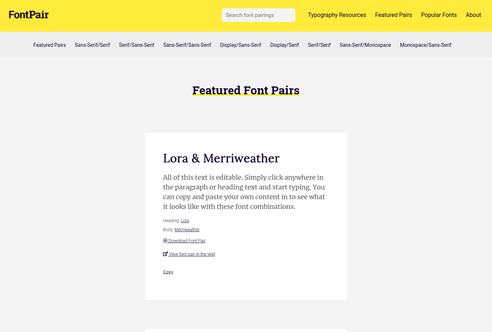
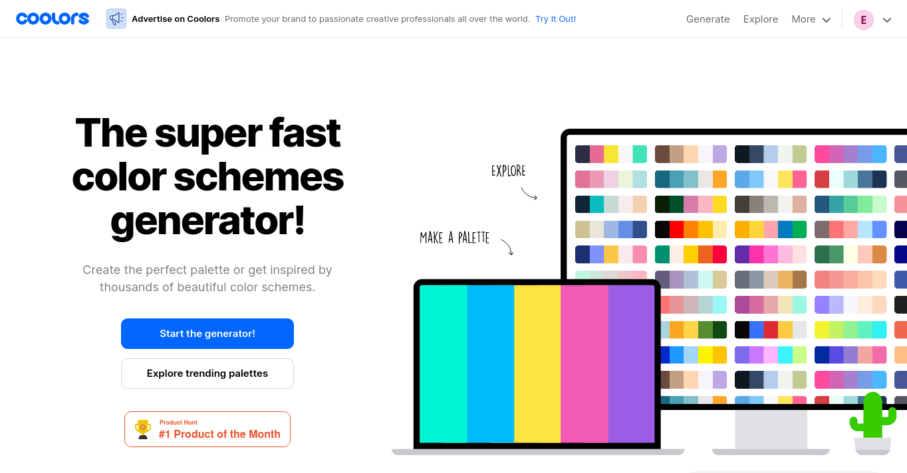
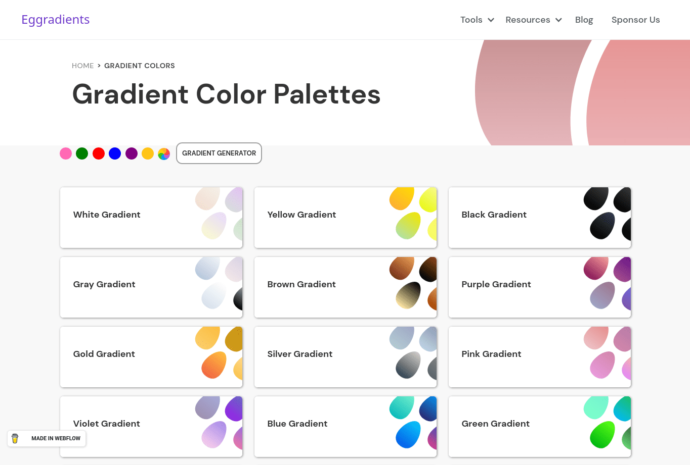
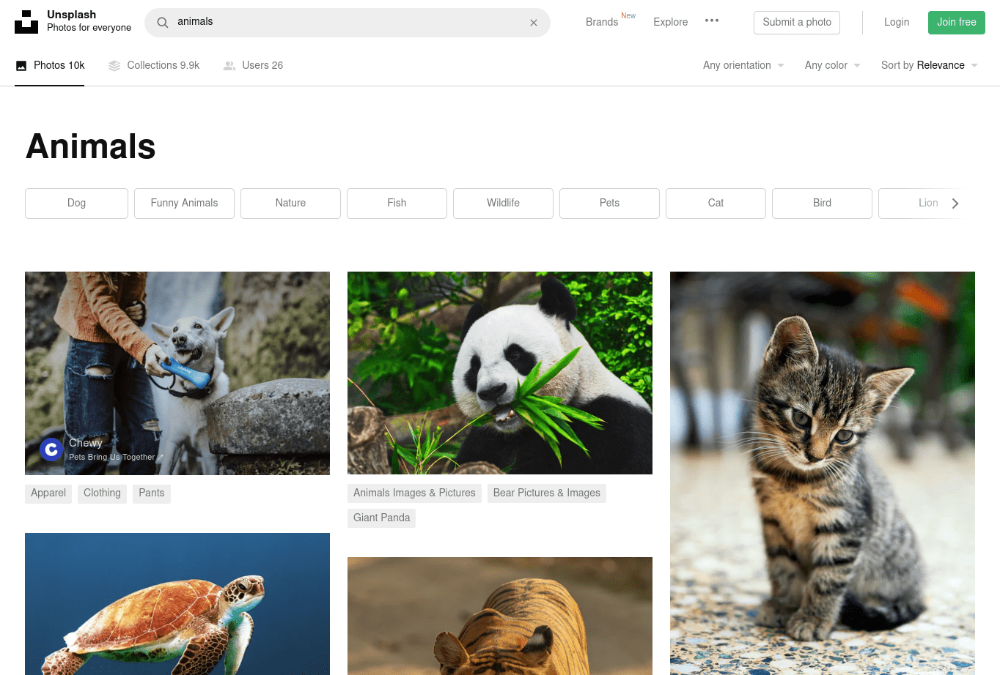

El mundo del frontend es algo maravilloso. Con tan solo un poco de HTML, CSS y JavaScript puedes llevar cualquier idea a un rincón de este mundo digital llamado Internet. La primera vez que desarrollas un sitio web y ves como miles de personas lo utilizan tiene algo mágico.  Sin duda es un súper poder que todos deberíamos tener.  Sin embargo, al inicio aprender sobre maquetación, estilos, patrones de diseño,  formatos, recursos, etc; puede llegar a ser algo complicado.

Por ello, si estás iniciando tu camino para ser una desarrolladora frontend, o ya tienes algo de tiempo, déjame recomendarte 10 sitios que te ayudarán a que tu vida sea más fácil y seas mucho mejor frontend developer.

## FontPair

Elegir un tipo de fuente para tus proyectos es algo que siempre puede ser tedioso. Las típicoss pensamienos sobre "¿Debería usar Serif o Sans Serif? Seguro se vería bien con Comic Sans, nunca falla". **Lo último por favor jamás lo hagas (¬_¬)**. 

Para resolver este problema te presento [FontPair](https://fontpair.co/). Este sitio me voló la cabeza al encontrarlo. Te muestra las fuentes más utilizadas en Internet, sus usos y hasta combinaciones para titulares y cuerpos. Además de llevarte directamente a [Google Fonts](https://fonts.google.com/) para seleccionar los tipos de fuentes que te recomienda. El elegir un estilo es mucho más sencillo gracias a esta herramienta.

> **✅ Pro tip:** Dedica algo de tiempo a aprender sobre tipografía. No solo se trata de que se vea lindo. El type face que elijas puede hacer una gran diferencia.

## Can I Use

Es normal que las propiedades que usas en CSS o tus etiquetas de HTML puedan ser no compatibles en algunos navegadores (Sí, te estoy viendo a ti Internet Explorer). Para verficar la compatibilidad de tu CSS y HTML, y asegurar que no se rompa nada de layout *layout* usa [Can I Use](https://caniuse.com/). De manera rápida, verifica si propiedades como **flexbox** son compatibles en los clásicos navegadores de escritorio como Chrome, hasta los navegadores móviles por defecto de marcas desconocidas. Lo genial de este sitio es que si tu propiedad o etiqueta no es compatible te da una serie de recomendaciones y documentación para que lo sea parcialmente.

## Coolors

En definitiva una de mis favoritas y de las más divertidas de usar es [Coolors](https://coolors.co/). Con unos cuantos golpecitos a tu barra de espacio crea paletas de colores geniales y ve eligiendo a la par los colores que más te gustan. También tiene cientos de paletas hechas por su comunidad. ¿Quieres más? Puedes exportar esas paletas directo a CSS o SASS. 🤩

## Egg Gradients

Pongámonos *fancys*. Los degradados han sido un recurso que ha marcado el diseño de los sitios web y en general de los productos digitales. Si no sabes cómo crear uno o te falta inspiración para eso tenemos a [Egg Gradients](https://www.eggradients.com/). Tiene una galería con muchos degradados en forma de huevo clasificados por colores. Por si no estás satisfecho también cuenta con un generador de degradados que te permitirá copiar el código directo a tu proyecto. 

## CSS-Tricks

Un lugar donde encontrarás todo lo que quieras saber sobre CSS con increíbles artículos, tutoriales y gráficos de la mejor forma explicada. Tiene una de las mejores guías sobre flexbox y grid que hay en todo Internet. Deberías darte una vuelta, acaban de renovar todo el diseño de su sitio. 😉

## Freepik and Flaticon

Bueno, estos son básicamente dos sitios pero *who cares* **¯\\_(ツ)_/¯**. Si alguna vez te has encontrado con la dificultad de encontrar buenos íconos o ilustraciones para tu web tanto [Freepik](https://www.freepik.es/) como [Flaticon](https://www.flaticon.es/). Cada uno respectivamente ofrece una enorme, pero en serio una ENORME cantidad de recursos gráficos: ilustraciones, fondos, packs de íconos, etc. La mayoría son completamente editables . En Freepik los recursos tienen un cierto límite de descarga diaria así que elige bien que te gustaría tener. Recuerda siempre dar crédito a su autor. 

## Unsplash

Ya sea que quieras imágenes asombrosas para tu web o un nuevo fondo de pantalla Unsplash es el sitio ideal. ¿Lo mejor de todo? ¡Es completamente gratis! Descarga hermosas imágenes en alta calidad con toda la libertad del mundo. No importa lo que quieras te apuesto que está en unsplash: gatos, perros, naturaleza, gente, productos, lugares, etc. Además cuentan con una API muy linda para consumir todas sus imágenes con varios filtros. Lo único que no puedes hacer es revender sus fotos o acumularlas para crear un sitio similar como un *Clonsplash*. 

## Smashing Magazine

Si quieres enterarte de los más nuevo sobre desarrollo web y estar diciendo con tus amigos**"that is so hot right now 🔥"** [Smashing Magazine](https://www.smashingmagazine.com/) es el sitio indicado.

  

Smashing Magazine es un sitio donde encontrarás las últimas tendencias sobre desarrollo web, consejos, tutoriales y recursos de profesionales alrededor de todo el mundo. Lo más genial es que tienen su propia editorial con libros que son una verdadera joya.  Además cada mes publican fondos de pantalla con un calendario para que agendes todas tus horas de código. 

## Beautiful CSS box-shadow examples

Esta [página](https://getcssscan.com/css-box-shadow-examples) es una colección de más de 85 efectos de sombras para tus componentes. Es una lista completamente curada con los mejores sitios y efectos desde Sketch hasta Stripe. Es un recurso muy útil si necesitas algo de inspiración o quieres lograr un efecto similar. 

## Browser Stack

Si tú al igual que a mi no tienes una Mac Pro y te gustaría conservar tu riñón para probar tus páginas web en Safari sin necesidad de tener que comprar una, tengo la solución para ti. [Browser Stack](https://www.browserstack.com/) es un sitio que te permite probar tu página web en muchos dispositivos reales, desde diferentes versiones de macOS hasta iPhones. Tiene un periodo de prueba de un minuto con cada version y dispositivo diarios pero es suficiente si quieres inspeccionar un bug. Sus precios son accesibles a comparación de comprar un equipo de Apple.

Estoy seguro que estos sitios te ayudarán a lo largo de tu camino como desarrolladora frontend. ¿Cuál fue tu sitio favorito? ¿Conoces algún otro que sea de utilidad? Déjalo en los comentarios y aprender de ti. Me encantaría leerte 😄

